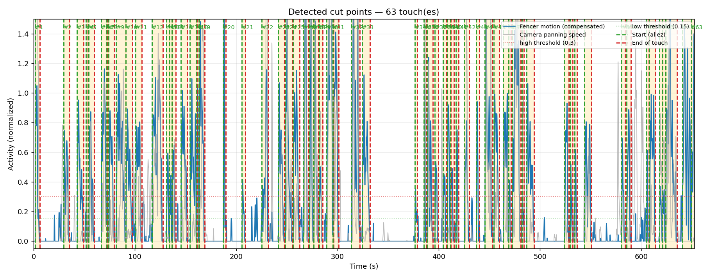

# fencing-cut

Automatic **touch-by-touch** cut detection for fencing videos filmed with a
panning (panoramic) camera. The tool finds where each touch (point) starts and
ends, produces a diagnostic plot and a CSV of cut points, and can optionally
slice the source video into one clip per touch.

## Example

The diagnostic plot shows the compensated fencer motion and the camera panning
speed over time, the high/low thresholds, and each detected touch highlighted:



## How it works

The hard part is that the camera is moving, so naive frame-differencing would
flag the panning itself as "action". `main.py` separates the two:

1. **Ego-motion** — track background feature points (KLT optical flow) and fit a
   robust similarity transform (RANSAC). The fencers are rejected as outliers.
   This yields a `pan_speed` signal (how fast the camera is panning).
2. **Compensated motion** — register the previous frame onto the current one
   using that transform, then measure the residual difference. What's left is
   the fencers' real movement, free of the background sweep. This yields an
   `fg_energy` signal (foreground motion energy).
3. **Segmentation** — smooth and normalize the foreground signal, then apply
   hysteresis thresholding: a touch is an active stretch between two rests.
   Short lulls are merged, too-short blips are dropped, and a little padding is
   added before/after each touch.

## Requirements

- Python ≥ 3.14
- [`ffmpeg`](https://ffmpeg.org/) on your `PATH` (only needed for `--cut`)
- Python deps: `numpy`, `scipy`, `opencv-python-headless`, `matplotlib`

This project uses [uv](https://docs.astral.sh/uv/). Dependencies are pinned in
`uv.lock` and installed automatically when you run with `uv run`.

## Usage

Detect touches and write a plot + CSV:

```bash
uv run python main.py video.mkv
```

By default this prints ready-to-use `ffmpeg` commands instead of cutting. To
auto-cut each detected touch into its own clip (re-encoded, in parallel):

```bash
uv run python main.py video.mkv --cut
```

Clips are written to `./output/` as `{video}_touch_NN.mp4`.

### Examples

```bash
# Custom output paths for the plot and CSV
uv run python main.py video.mkv --out plot.png --csv cuts.csv

# Tune sensitivity (higher thresholds = fewer/cleaner touches)
uv run python main.py video.mkv --high 0.30 --low 0.15 --min-rest 1.0

# Cut into a custom folder, 8 parallel jobs, faster encode
uv run python main.py video.mkv --cut --cut-dir clips --jobs 8 --preset fast --crf 20
```

## Options

| Option | Default | Description |
| --- | --- | --- |
| `video` | — | Input video (positional) |
| `--out` | `cuts_plot.png` | Diagnostic plot image |
| `--csv` | `cuts.csv` | CSV of cut points |
| `--width` | `480` | Processing width in px (lower = faster) |
| `--high` | `0.30` | High threshold — activity above this enters a touch |
| `--low` | `0.15` | Low threshold — activity below this exits a touch |
| `--min-rest` | `0.8` | Minimum rest between touches, in seconds (shorter gaps are merged) |
| `--min-touch` | `0.4` | Minimum touch duration, in seconds (shorter blips are dropped) |
| `--pre-pad` | `0.5` | Padding added before each touch, in seconds |
| `--post-pad` | `1.0` | Padding added after each touch, in seconds |
| `--pan-weight` | `0.0` | Weight of the panning signal in the activity (0 = ignore) |
| `--cut` | off | Auto-cut detected touches into clips with ffmpeg (in parallel) |
| `--cut-dir` | `./output` | Output folder for the clips |
| `-j`, `--jobs` | `4` | Number of parallel ffmpeg jobs |
| `--crf` | `17` | x264 CRF quality (lower = better quality, larger files) |
| `--preset` | `slow` | x264 encoding preset |

## Output

- **Plot** (`--out`): foreground motion and panning speed over time, with the
  high/low thresholds and each detected touch highlighted.
- **CSV** (`--csv`): one row per touch with columns
  `touch, start_s, end_s, start_frame, end_frame, duration_s`.
- **Clips** (with `--cut`): one re-encoded `.mp4` per touch, frame-accurate,
  written in parallel.
